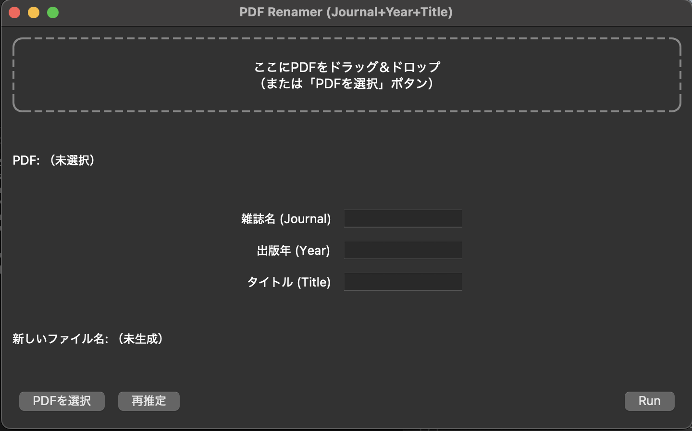

# PDF Renamer
論文のPDFの名前を変更するためのGUIです。論文管理に有用です。

## セットアップ & 実行方法
本プロジェクトは `environment.yml` を使って Conda 環境を構築し、`pdf_renamer.py` を実行します。

### 1. 環境を作成
Conda を利用します。
Conda がインストールされていない場合は、事前に Miniconda または Anaconda をインストールしてください。
```bash
conda env create -f environment.yml -n PaperRenamer
```

### 2. 環境を有効化
```bash
conda activate PaperRenamer
```

### 3. Python を実行
プロジェクトのルートディレクトリで以下を実行してください。
```bash
python pdf_renamer.py
```
すると、以下のようなGUI が立ち上がります。



Run ボタンを押すと、PDF名が、`雑誌名+出版名+タイトル.pdf` になります。
#### 例
* 雑誌名：Nature
* 出版年：2021
* タイトル：Magnetic sensitivity of cryptochrome 4 from a migratory songbird

→ Nature2021MagneticSensitivityOfCryptochrome4FromAMigratorySongbird.pdf

### 4. 日常使いするには

以下のシェルスクリプトを作り、Automator（またはショートカット）から実行すると便利。
```bash
#!/usr/bin/env bash
source "$HOME/anaconda3/etc/profile.d/conda.sh"
conda activate PaperRenamer
python /Path/PaperRenamer/pdf_renamer.py
```